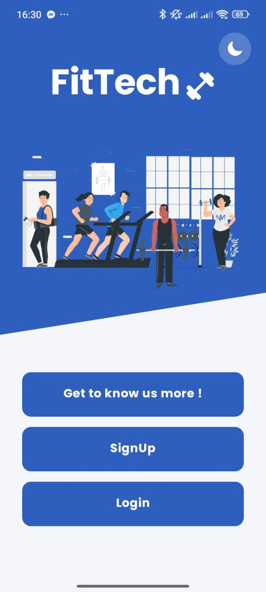
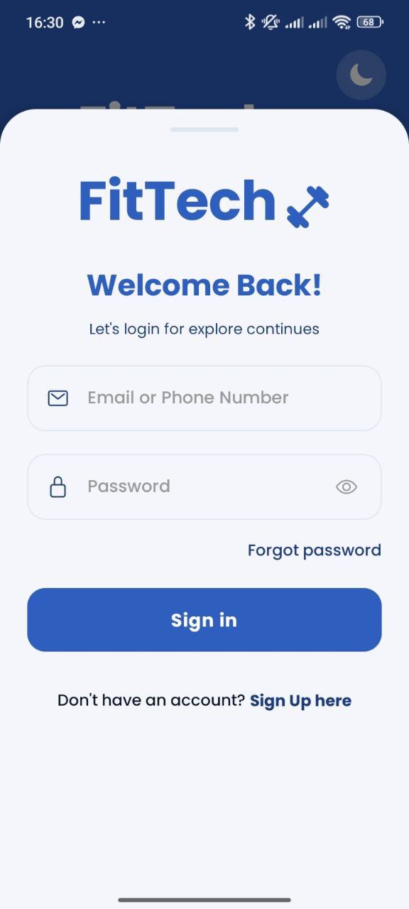
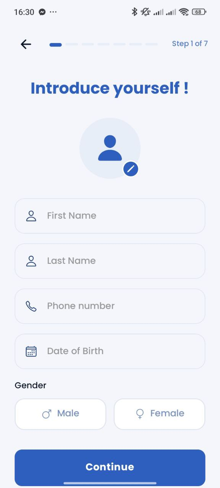

# FitTech - Smart Fitness Management 🏋️‍♂️📱

[](https://reactnative.dev/)
[](https://expo.dev/)
[](https://www.typescriptlang.org/)
[](LICENSE)

FitTech is a professional, high-performance fitness management mobile application. Engineered for speed and visual excellence, it provides gym members with a premium interface to track health metrics, manage personal goals, and navigate their fitness journey with ease.

---

## ✨ Key Features

### 🔐 Sophisticated Authentication
- **Multi-Step Onboarding**: A logic-heavy 7-step registration flow to capture precise health data (metrics, goals, activities).
- **Secure Access**: JWT-based authentication with automatic token refreshing and ultra-secure device storage.

### 🎨 Premium UI/UX Experience
- **Unified Appearance**: A single, streamlined selector for **Light**, **Dark**, and **Auto** (System) modes.
- **Dynamic Animations**: Smooth transitions and micro-animations built with **React Native Reanimated**.
- **Modern Typography**: Carefully selected Google Fonts (Poppins, Bebas Neue) for a state-of-the-art aesthetic.

### 📊 Health & Profile Management
- **Metric Tracking**: Integrated management of height, weight, and fitness objectives.
- **Interactive Selectors**: Custom-built UI components for medical restrictions and goal selection.

---

## 🛠️ Technology Stack

| Layer | Technology |
| :--- | :--- |
| **Framework** | [React Native](https://reactnative.dev/) + [Expo SDK 54](https://expo.dev/) |
| **Logic** | [TypeScript](https://www.typescriptlang.org/) (Strict Mode) |
| **State** | [Redux Toolkit](https://redux-toolkit.js.org/) + [Redux Persist](https://github.com/rt2zz/redux-persist) |
| **Data Fetching** | [TanStack Query v5](https://tanstack.com/query/latest) |
| **Navigation** | [React Navigation v7](https://reactnavigation.org/) |
| **Animations** | [React Native Reanimated v4](https://docs.swmansion.com/react-native-reanimated/) |
| **Forms** | [React Hook Form](https://react-hook-form.com/) + [Yup Validation](https://github.com/jquense/yup) |

---

## 🏗️ Architecture Design

The project follows a **Feature-Sliced Design (FSD)** approach, ensuring clean separation of concerns and effortless scalability:

- **`src/features`**: Core business domains like `Auth`, `Account`, and `Home`.
- **`src/shared`**: Cross-feature infrastructure (UI components, themes, hooks, services).
- **`src/navigation`**: Type-safe routing system for both Tab and Stack navigators.
- **`src/store`**: Persistent global state with encrypted storage adapters.

---

## 🚀 Getting Started

### Prerequisites
- **Node.js** (v18 or higher)
- **Expo Go** app on your physical device or a configured emulator.

### Installation & Launch

1. **Clone & Install**:
   ```bash
   git clone https://github.com/AchirAmine/fittech-app.git
   cd fittech-app
   npm install
   ```

2. **Environment Configuration**:
   Create a `.env` file in the root directory:
   ```env
   EXPO_PUBLIC_API_URL=https://your-api-endpoint.com/api
   ```

3. **Run Application**:
   ```bash
   npx expo start
   ```

---

## 📸 Screenshots

| Auth Choice | Login | Register | Account |
| :---: | :---: | :---: | :---: |
|  |  |  |  |

---

## 📄 License & Ownership
This project is the private property of **FitTech**. Unauthorized copying or distribution is strictly prohibited.

Built with ❤️ by [Achir Mohamed Amine]
