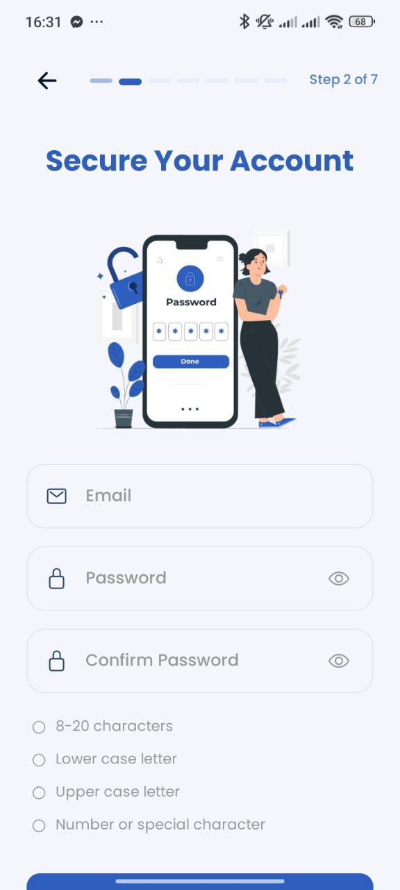

# FitTech - Smart Fitness Management 🏋️‍♂️📱

FitTech is a professional, high-performance fitness management mobile application built with **React Native** and **Expo**. It provides a seamless experience for gym members to track their progress, book classes, and manage their health profile with a cutting-edge UI/UX.

---

## ✨ Key Features

- **🔐 Advanced Authentication Flow**: Secure Login and a sophisticated 7-step Multi-step Registration process.
- **🛡️ Secure Token Management**: Automatic token refresh and secure sensitive data storage.
- **🎨 Premium UI/UX**: Built with custom design tokens, dark/light mode support, and smooth micro-animations using React Native Reanimated.
- **📊 Personalized Health Profiles**: Goal tracking, body metrics integration, and medical restriction management.
- **🚀 Scalable Architecture**: Implements a feature-sliced architecture for maximum maintainability.

## 🛠️ Technology Stack

| Layer | Technology |
| :--- | :--- |
| **Core** | [React Native](https://reactnative.dev/) + [Expo](https://expo.dev/) |
| **State Management** | [Redux Toolkit](https://redux-toolkit.js.org/) + [Redux Persist](https://github.com/rt2zz/redux-persist) |
| **Language** | [TypeScript](https://www.typescriptlang.org/) |
| **Navigation** | [React Navigation (Stack & Tabs)](https://reactnavigation.org/) |
| **Styling** | Vanilla StyleSheet + Custom Theme System |
| **Animations** | [React Native Reanimated](https://docs.swmansion.com/react-native-reanimated/) |
| **Networking** | [Axios](https://axios-http.com/) with Interceptors |
| **Typography** | Poppins (via [Google Fonts](https://fonts.google.com/)) |

## 🏗️ Architecture Highlights

The project follows a **Feature-Sliced Design (FSD)** approach to ensure scalability:
- **`src/features`**: Domain-driven modules (Auth, Member, etc.).
- **`src/shared`**: Reusable infrastructure (Hooks, Services, UI Components, Utils).
- **`src/navigation`**: Centralized routing logic with strong typing.
- **`src/store`**: Global state persistence with secure storage.

## 🚀 Getting Started

### Prerequisites
- Node.js (v18+)
- npm or yarn
- Expo Go (on your mobile device or emulator)

### Installation
1.  **Clone the repository**:
    ```bash
    git clone https://github.com/AchirAmine/fittech-app.git
    cd fittech-app
    ```
2.  **Install dependencies**:
    ```bash
    npm install
    ```
3.  **Set up Environment Variables**:
    Create a `.env` file in the root and add your API URL:
    ```env
    EXPO_PUBLIC_API_URL=https://your-api-endpoint.com/api
    ```
4.  **Start the application**:
    ```bash
    npm start
    ```

> 💡 **Developer Note:** For detailed technical documentation including architecture, Redux/JWT flow, and project structure, please refer to the [Setup & Technical Guide](./README_SETUP.md).

## 📸 Screenshots

| Auth Choice | Login | Register 1 | Register 2 |
| :---: | :---: | :---: | :---: |
|  |  |  |  |

## 📄 License
This project is private property of **FitTech**. All rights reserved.

---

Built with ❤️ by [Achir Mohamed Amine]
